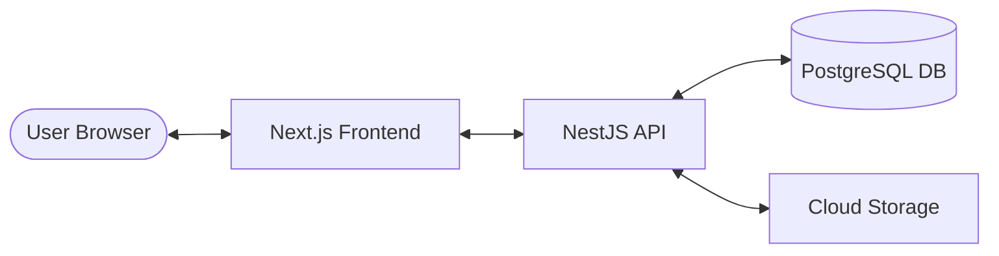
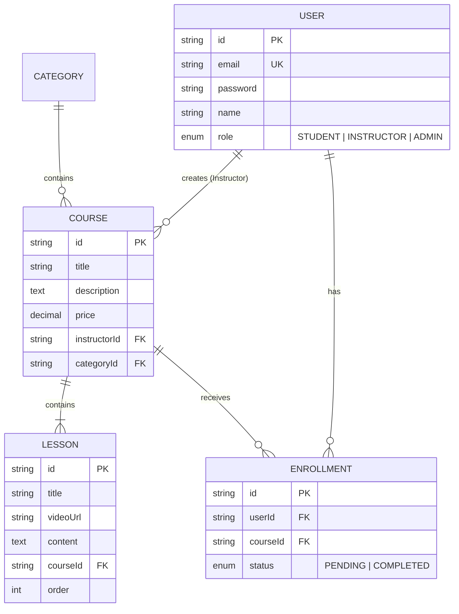

# LMSCore System Architecture

This document provides a high-level overview of the **LMSCore** architecture, detailing how the frontend and backend interact, the data model, and the security implementation.

---

## 🏗️ High-Level Overview

LMSCore follows a classic **Client-Server** architecture with a clear separation of concerns between the presentation layer and the business logic layer.

---

## 🔐 Authentication Flow

LMSCore uses **JWT (JSON Web Tokens)** for stateless authentication.

1. **Login**: User submits credentials to `/api/auth/login`.
2. **Verification**: Backend validates credentials against the database.
3. **Token Issuance**: Backend generates a JWT containing user ID and role.
4. **Storage**: Frontend receives the token and stores it (typically in a secure cookie or local storage).
5. **Authorized Requests**: For subsequent requests, the frontend includes the JWT in the `Authorization: Bearer <token>` header.
6. **Guard**: Backend uses a `JwtAuthGuard` to protect routes and extract user information.

---

## 📊 Data Model

The database schema is designed for flexibility and scalability, supporting multi-role interactions and complex course structures.

---

## 🛠️ Key Technologies

### Frontend (`/frontend`)
- **Next.js 15**: Utilizes the App Router for efficient routing and server-side rendering.
- **Redux Toolkit**: Manages global state for authentication and course data.
- **Tailwind CSS 4**: Provides a modern, utility-first styling system.
- **Framer Motion**: Enables fluid micro-animations and transitions.

### Backend (`/backend`)
- **NestJS**: A modular framework that ensures highly testable and maintainable code.
- **Prisma**: A type-safe ORM that simplifies database operations.
- **PostgreSQL**: A reliable relational database for storing complex data structures.
- **Passport.js**: Standardized middleware for handling authentication strategies.

---

## 📦 Deployment & DevOps

- **Docker**: The entire system is containerized for consistent development and deployment environments.
- **CI/CD**: (TBD) Automation workflows for testing and deployment.
- **Supabase**: Used for managed PostgreSQL hosting and potentially file storage.
